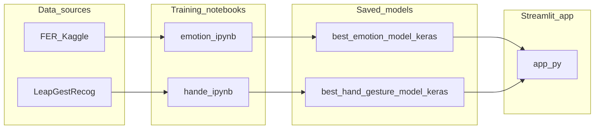

# Emotion and Hand Gesture Recognition: A Complete Machine Learning System

**Technical report (draft for Word/PDF submission)**

| Field | Your details (fill in) |
| --- | --- |
| Student name |  |
| Student ID |  |
| Module / course |  |
| Date |  |

---

## Abstract

This report documents the end-to-end development of a dual-purpose machine learning system for **facial expression (emotion) classification** and **static hand gesture classification**, trained on public image datasets and deployed through a **Streamlit** web application. Three model families—**artificial neural network (ANN)**, **convolutional neural network (CNN)**, and **VGG16 transfer learning**—were implemented, trained, and compared using standard metrics and visual diagnostics. The best checkpoint per task was exported as Keras `.keras` files and loaded at inference time, with optional **MediaPipe** face and hand localization for multi-subject images. The narrative follows problem framing, data handling, implementation choices, experimental evaluation, model selection, and deployment evidence. **Replace bracketed figure placeholders and metric tables with your own screenshots and numbers after re-running notebooks and the app.**

*Keywords:* deep learning, image classification, transfer learning, Streamlit, FER, LeapGestRecog, MediaPipe.

---

## Table of contents

*(In Word: use References → Table of Contents. The headings below match the rubric.)*

1. [Problem definition and system framing](#1-problem-definition-and-system-framing-15)
2. [Data pipeline and feature handling](#2-data-pipeline-and-feature-handling-15)
3. [Model implementation and debugging](#3-model-implementation-and-debugging-20)
4. [Experimental evaluation and model selection](#4-experimental-evaluation-and-model-selection-20)
5. [Deployment, presentation, and lessons learned](#5-deployment-presentation-structure-and-communication-10)
6. [Appendix A: Figure and screenshot checklist](#appendix-a-figure-and-screenshot-checklist)
7. [Appendix B: Key files and report mapping](#appendix-b-key-files-and-report-mapping)

---

## 1. Problem definition and system framing (15%)

### 1.1 Real-world problem

Understanding **human affect** (emotional state from the face) and **hand gestures** from images is relevant to human–computer interaction, accessibility tools, classroom or workplace analytics (where ethically appropriate), and prototyping of interactive systems. Both problems are **perceptual**: the same emotion or gesture can appear with different lighting, skin tone, pose, clothing, and background clutter. A robust solution must generalise beyond a handful of curated examples.

### 1.2 Why machine learning

Hand-crafted rules (e.g. thresholding skin colour or fixed geometric rules) are fragile under real-world variation. **Supervised learning** from large labelled datasets lets the system learn discriminative patterns from data. Convolutional architectures and pre-trained backbones are standard for image classification because they capture spatial structure and can reuse features learned on large source domains (e.g. ImageNet).

### 1.3 Task formulation

Two separate **multi-class classification** tasks were defined:

| Task | Input | Output | Dataset source (training) |
| --- | --- | --- | --- |
| Emotion | Face region (RGB image) | One of seven emotion labels | FER-style split via Kaggle (`ananthu017/emotion-detection-fer`) |
| Hand gesture | Hand region (RGB image) | One of ten gesture classes | Leap Gesture Recognition (`gti-upm/leapgestrecog`) |

**Deployment formulation:** A single Streamlit application (`app.py`) lets the user choose **Emotion Detection** or **Hand Gesture Recognition**. For images with multiple faces or hands, **MediaPipe** detectors provide bounding regions; each crop is resized and passed to the corresponding Keras model. If no face or hand is detected, the pipeline falls back to the **full frame** so inference still runs (useful for tightly framed photos).

### 1.4 System overview and design reasoning

Splitting the problem into **two models** (emotion vs gesture) reflects different label spaces, data sources, and failure modes. Sharing one Streamlit shell reduces deployment friction and demonstrates integration of multiple ML components in one place.

**[Figure 1 — Insert image: `work Follow.png`]**  
*Suggested caption: High-level workflow of the project (training path and/or inference path as you drew it).*

**[Figure 2 — Insert image: `Work Follow advance.png`]**  
*Suggested caption: Extended or detailed workflow (e.g. notebook steps, deployment, or dual-module app).*

The following diagram summarises **data → training artefacts → deployed app** (suitable for Word if you export Mermaid to PNG, or paste as-is where supported):

**[Figure 3 — Optional: export of the Mermaid diagram above]**  
*Caption: End-to-end system context from datasets through notebooks to saved models and Streamlit.*

---

## 2. Data pipeline and feature handling (15%)

### 2.1 Emotion data (`emotion.ipynb`)

- **Acquisition:** The notebook downloads the dataset via `kagglehub` from the Kaggle dataset `ananthu017/emotion-detection-fer`.
- **Structure:** Images are organised under `train/<emotion>/` and `test/<emotion>/`. A pandas DataFrame stores relative `filename` and `class` for every image.
- **Split:** The notebook uses the dataset’s **official train vs test folders** rather than a random 80/20 split on the combined pool, preserving the benchmark’s intended separation.
- **Loading:** `ImageDataGenerator` with `flow_from_dataframe` provides batched RGB images at a fixed spatial size (**128×128** in the configuration cells), with **categorical** labels for softmax training.

### 2.2 Hand gesture data (`hande.ipynb`)

- **Acquisition:** `kagglehub` downloads `gti-upm/leapgestrecog`.
- **Structure:** Nested layout `leapGestRecog/<user_id>/<gesture_folder>/<images>`, e.g. `01_palm`, `02_l`, …, `10_down`.
- **DataFrame:** Each row links a relative path to a **gesture folder name** as the class label.
- **Train/test:** The notebook uses `train_test_split` (see your executed notebook for the exact test fraction and random seed) so that evaluation is on **held-out** images not seen during training.

### 2.3 Preprocessing and augmentation (training)

| Stage | Training set | Validation / test flow |
| --- | --- | --- |
| Rescale | Typically `1/255` to map pixels to approximately [0, 1] | Same rescale for consistency |
| Spatial size | Resize to **128×128** RGB | Same target size |
| Augmentation (train only) | e.g. shear, zoom, horizontal flip (as in `ImageDataGenerator`) | **No** augmentation (honest evaluation) |

**Reasoning:** Augmentation increases effective diversity and reduces overfitting to pose and minor transforms. Holding augmentation off the test set ensures reported metrics reflect generalisation, not synthetic variation of the evaluation batch.

**[Figure 4 — Screenshot: emotion or hand notebook “Step 2b” preprocessing visualisation]**  
*Caption: Example image before/after rescale and augmented variants.*

### 2.4 Inference-time handling (`app.py`)

- **Resize:** Frames or crops are resized to the user-configurable input size (default **128**), using OpenCV when available or PIL otherwise.
- **Normalisation:** If the loaded model is detected as **VGG-style** (heuristic on layer names), inputs use `tensorflow.keras.applications.vgg16.preprocess_input`; otherwise pixels are scaled with **`/255.0`**, matching typical CNN/ANN training in the notebooks.
- **Localisation:** MediaPipe **FaceDetection** and **Hands** produce regions of interest; crops are padded slightly for context before classification.

**[Figure 5 — Optional diagram: Crop → resize → preprocess → predict → label]**  
*Caption: Inference pipeline for a single detected face or hand.*

---

## 3. Model implementation and debugging (20%)

### 3.1 Architectures (both notebooks)

Three model families were implemented for **comparison**, not only for a single “best” architecture:

1. **ANN (`HandGesture_ANN` / `EmotionFER_ANN`):** Flatten input → stacked Dense layers with Dropout → softmax over classes. *Rationale:* Baseline aligned with introductory neural-network teaching; fast to train but weak on spatial structure.
2. **Custom CNN (`HandGesture_CNN` / `EmotionFER_CNN`):** Stacked Conv2D + MaxPooling + Dropout → Dense head. *Rationale:* Exploit local spatial patterns (edges, textures) appropriate for images.
3. **VGG16 transfer learning (`HandGesture_VGG16` / `EmotionFER_VGG16`):** ImageNet-pretrained VGG16 base (frozen), **GlobalAveragePooling2D**, regularised Dense head, softmax. *Rationale:* Strong generic visual features with fewer trainable parameters in the head; often strong accuracy when data are limited.

### 3.2 Training practice

- **Optimisation:** Categorical cross-entropy with softmax outputs; Adam or as specified in your notebook cells.
- **Callbacks:** **EarlyStopping** and **ReduceLROnPlateau** (and any others you used) stabilise training and reduce wasted epochs.
- **Class imbalance:** The notebooks include **class weight** computation where appropriate; state whether you enabled it in your final runs.

**[Figure 6 — Screenshot: CNN `Sequential` model definition from one notebook]**  
*Caption: Custom CNN architecture excerpt (Conv/Pool/Dropout pattern).*

**[Figure 7 — Screenshot: VGG16 model head construction]**  
*Caption: Transfer-learning head on frozen VGG16 base.*

**[Figure 8 — Screenshot: callbacks configuration (`EarlyStopping`, `ReduceLROnPlateau`)]**  
*Caption: Training stabilisation and learning-rate adaptation.*

### 3.3 Application engineering (`app.py`)

- **Model loading:** `tensorflow.keras.models.load_model` wrapped in `@st.cache_resource` so weights load once per session.
- **Label source (gestures):** `labels.json`, or scanning `leapGestRecog`, or built-in fallback list matching folder naming.
- **Emotion labels:** Fixed list in code: angry, disgusted, fearful, happy, neutral, sad, surprised.
- **Robustness:** Optional dependencies (OpenCV, MediaPipe, WebRTC, TensorFlow) are guarded so the UI can still start and show clear errors on unsupported runtimes (e.g. Python 3.13 without TensorFlow wheels).

**[Figure 9 — Screenshot: `predict_image` / `preprocess_image` or multi-detection function in `app.py`]**  
*Caption: Inference and preprocessing logic in the deployed application.*

### 3.4 Debugging and iteration (what to describe in your own words)

In your final PDF, add **two short paragraphs** based on what you actually did, for example: misclassified classes, adjusting learning rate or dropout, fixing path bugs, reconciling label order with `class_indices`, or matching preprocess between training and deployment. **Do not invent incidents**; document real issues you hit.

---

## 4. Experimental evaluation and model selection (20%)

### 4.1 Metrics

- **Accuracy** and **loss** on the held-out test generator.
- **Per-class precision, recall, F1** via `sklearn.metrics.classification_report`.
- **Confusion matrix** via `confusion_matrix` and heatmap (e.g. seaborn).
- **Model comparison:** Parameter counts vs test accuracy (“compression” style plots in the notebooks).

### 4.2 Comparative results (fill from your notebook outputs)

**Emotion models — replace with your numbers**

| Model | Test accuracy | Test loss | Notes |
| --- | --- | --- | --- |
| ANN | *TBD* | *TBD* | Baseline |
| CNN | *TBD* | *TBD* | Custom spatial model |
| VGG16 | *TBD* | *TBD* | Transfer learning |

**Hand gesture models — replace with your numbers**

| Model | Test accuracy | Test loss | Notes |
| --- | --- | --- | --- |
| ANN | *TBD* | *TBD* | Baseline |
| CNN | *TBD* | *TBD* | Custom spatial model |
| VGG16 | *TBD* | *TBD* | Transfer learning |

**[Figure 10 — Screenshot: training / validation accuracy and loss curves for best or all models]**  
*Caption: Convergence behaviour and evidence of overfitting or early stopping.*

**[Figure 11 — Screenshot: confusion matrix heatmap for best emotion model]**  
*Caption: Where the emotion model confuses classes (off-diagonal mass).*

**[Figure 12 — Screenshot: confusion matrix heatmap for best hand model]**  
*Caption: Gesture confusions (e.g. similar hand shapes).*

**[Figure 13 — Screenshot: “compression comparison” bar charts (parameters vs accuracy)]**  
*Caption: Trade-off between model size and accuracy across ANN, CNN, VGG16.*

**[Figure 14 — Screenshot: sample predictions grid (true vs predicted)]**  
*Caption: Qualitative success cases on test batches.*

**[Figure 15 — Screenshot: misclassified examples]**  
*Caption: Failure cases guiding future improvements.*

### 4.3 Final model selection (evidence-based)

The notebook workflow saves the **best** checkpoint to disk as:

- `best_emotion_model.keras`
- `best_hand_gesture_model.keras`

**Your report must state explicitly:** which architecture name won (e.g. `EmotionFER_VGG16` vs CNN), the **numeric evidence** (test accuracy and loss), and **why** that choice is justified (e.g. higher macro-F1, better diagonal on confusion matrix, acceptable model size). If the winner was CNN rather than VGG16, say so and show the table that proves it.

---

## 5. Deployment, presentation, structure, and communication (10%)

### 5.1 Streamlit deployment

Run locally: `pip install -r requirements.txt` then `streamlit run app.py`. The app offers:

- Module choice: **Emotion Detection** vs **Hand Gesture Recognition**
- Input modes: **single capture**, **multiple uploads**, **live webcam** (where `streamlit-webrtc` is available)
- Sidebar: image size, optional forced VGG preprocessing, return to start

**[Figure 16 — Screenshot: welcome / module selection screen]**  
*Caption: User entry point and module choice.*

**[Figure 17 — Screenshot: emotion module with bounding boxes and labels]**  
*Caption: Multi-face emotion inference in the deployed app.*

**[Figure 18 — Screenshot: hand gesture module with bounding boxes and labels]**  
*Caption: Multi-hand gesture inference in the deployed app.*

**[Figure 19 — Screenshot: sidebar settings]**  
*Caption: Configurable inference parameters.*

**[Figure 20 — Optional: live WebRTC stream with overlay]**  
*Caption: Real-time processing every N frames.*

### 5.2 Professional presentation checklist

- Number all figures and tables; reference them in the text (“see Figure 11”).
- Keep **code screenshots** to **short, legible** excerpts with syntax visible; avoid multi-page dumps.
- Spell-check; use consistent terminology (e.g. “validation” vs “test” as in your notebooks).
- One consolidated **PDF** for Turnitin.

### 5.3 Reflection (what you learned)

Write **150–250 words** on limitations (dataset bias, lighting, single-frame emotion ambiguity), ethical use of affect recognition, and plausible next steps (temporal models, larger data, fairness audits).

---

## Appendix A: Figure and screenshot checklist

Use this list when assembling the Word/PDF. Tick when inserted.

| ID | Source | What to capture | Suggested caption theme |
| --- | --- | --- | --- |
| F1 | Repo | `work Follow.png` | Overall project workflow |
| F2 | Repo | `Work Follow advance.png` | Detailed / advanced workflow |
| F3 | Export | Mermaid system diagram (Section 1) | System context diagram |
| F4 | `emotion.ipynb` or `hande.ipynb` | Step 2b preprocessing figure | Data prep and augmentation |
| F5 | Draw or screenshot | Simple inference pipeline | Face/hand crop to prediction |
| F6 | Notebook | CNN `Sequential` definition | Custom CNN design |
| F7 | Notebook | VGG16 head on frozen base | Transfer learning design |
| F8 | Notebook | Callbacks cell | Training control |
| F9 | `app.py` in IDE | `preprocess_image` / `predict_image` / multi-predict | Deployment inference logic |
| F10 | Notebook | Training curves | Convergence / early stopping |
| F11 | Notebook | Emotion confusion matrix | Emotion error analysis |
| F12 | Notebook | Gesture confusion matrix | Gesture error analysis |
| F13 | Notebook | Compression comparison plots | Size vs accuracy trade-offs |
| F14 | Notebook | Sample predictions grid | Qualitative results |
| F15 | Notebook | Misclassified montage | Failure analysis |
| F16 | Streamlit | Welcome / Start screen | Application entry |
| F17 | Streamlit | Emotion results with boxes | Emotion deployment evidence |
| F18 | Streamlit | Gesture results with boxes | Gesture deployment evidence |
| F19 | Streamlit | Sidebar | User-configurable inference |
| F20 | Streamlit | Live webcam (if used) | Real-time demonstration |

---

## Appendix B: Key files and report mapping

| File | Role | Report section |
| --- | --- | --- |
| `emotion.ipynb` | FER data pipeline; ANN/CNN/VGG16; evaluation; saves `best_emotion_model.keras` | §2, §3, §4 |
| `hande.ipynb` | LeapGestRecog pipeline; same model families; saves `best_hand_gesture_model.keras` | §2, §3, §4 |
| `best_emotion_model.keras` | Trained emotion classifier (Keras bundle) | §1, §4, §5 |
| `best_hand_gesture_model.keras` | Trained gesture classifier (Keras bundle) | §1, §4, §5 |
| `app.py` | Streamlit UI, MediaPipe, preprocessing, inference | §1, §2, §3, §5 |
| `requirements.txt` | Python dependencies (Streamlit, TF, numpy, mediapipe, webrtc, etc.) | §3, §5 |
| `labels.json` (if present) | Gesture class name order for the app | §2, §3 |
| `work Follow.png`, `Work Follow advance.png` | Workflow figures for the report | §1, Appendix A |

---

*End of draft. Paste into Microsoft Word, insert figures at placeholders, fill tables with your measured results, generate PDF, submit to Turnitin.*
